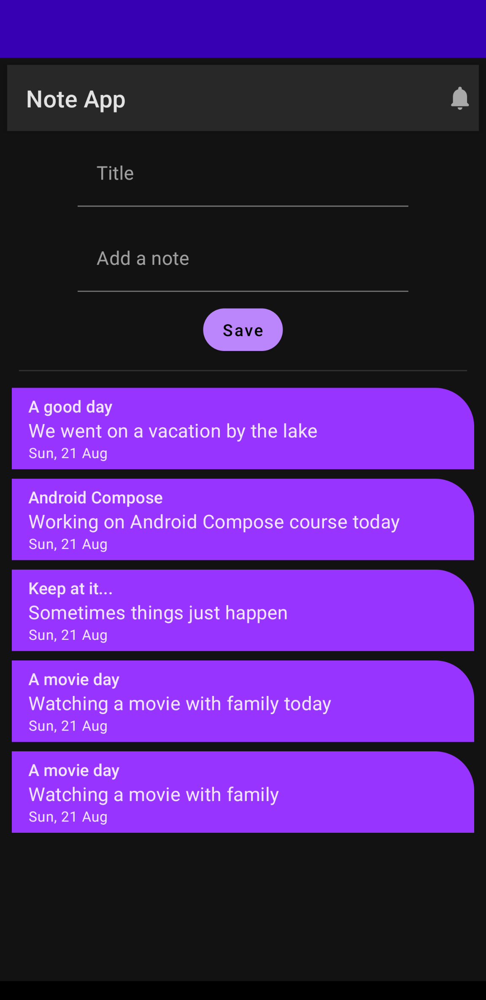
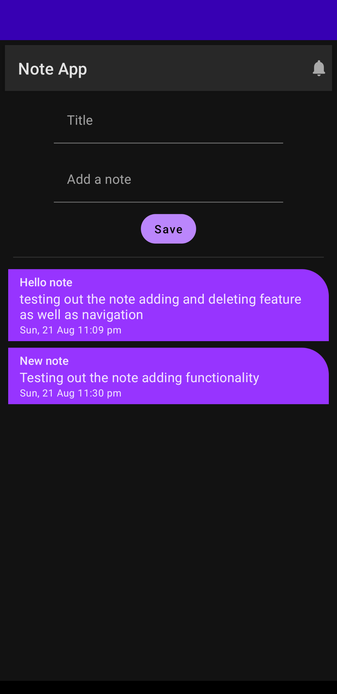
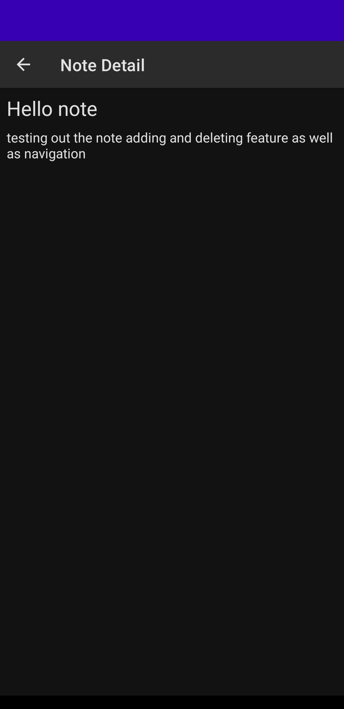

Note Application based Udemy course - Android Jetpack Compose: The Comprehensive Bootcamp \[2022]

Contains modified code and makes use of:
- Compose 
- ViewModels
- Coroutine Flows
- Room for note persistence
- Navigation component for compose
- Dagger Hilt for dependency injection
- Repository pattern
- MVVM

User guide:
- Tap on note item to open in detail screen
- Only letters and whitespaces allowed in title
- long tap on note item to delete

TODO:
- double tap on note item to update item

    

     
    
     

